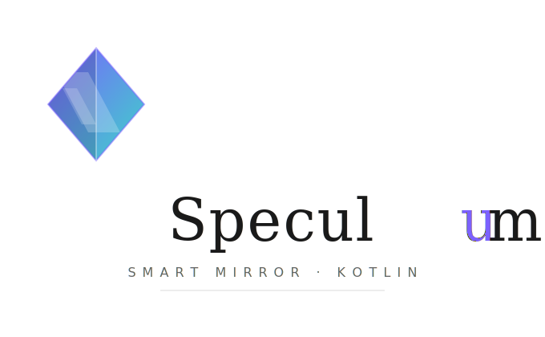

A [Compose for Desktop](https://www.jetbrains.com/lp/compose-multiplatform/) (JVM)
reimagining of [MagicMirror²](https://github.com/MagicMirrorOrg/MagicMirror): a
modular smart-mirror dashboard. Bright modules on a pure-black background so it
reflects as a "magic mirror" behind two-way glass. Starts fullscreen.

Modules are **plug-ins**: each ships as its own JAR, dropped into `plugins/`, and
is discovered at runtime via reflection — add or remove features without
rebuilding the app.

## How it maps to MagicMirror

| MagicMirror² concept             | This project                                  |
|----------------------------------|-----------------------------------------------|
| `config.js` modules array        | `MirrorConfig` / `ModuleConfig` (JSON)        |
| `Module.register(...)`           | `MirrorModule` abstract class                 |
| module lifecycle (`start`, etc.) | `start()` / `refresh()` / `stop()`            |
| screen regions (top_left, ...)   | `Region` enum + `MirrorScreen` layout         |
| `sendNotification` bus           | `Notification` + `MirrorEngine.broadcast()`   |
| `node_helper` data fetching      | provider classes (e.g. `WeatherProvider`)     |
| 3rd-party modules folder         | external JAR plugins (`ModuleFactory` SPI)    |

## Default modules

Each is its own Gradle subproject under `modules/`, built to a JAR in `plugins/`:

- **clock** — live time/date, optional analog face (`modules/clock-module`)
- **weather** — current conditions, free Open-Meteo API (`modules/weather-module`)
- **weatherforecast** — multi-day outlook, monochrome vector icons (same JAR)
- **calendar** — upcoming events from ICS feeds (`modules/calendar-module`)
- **compliments** — time-of-day greetings, date specials (`modules/compliments-module`)
- **newsfeed** — rotating RSS/Atom headlines (`modules/newsfeed-module`)
- **example** — fully-commented reference module (`modules/example-module`)

## Project layout

```
mirror-api/            shared API: MirrorModule, ModuleConfig, Region,
                       MirrorColors, ModuleFactory (compiled against by all)
composeApp/            the desktop app (engine, layout, plugin loader, theme)
modules/<name>-module/ one Gradle subproject per module  ─┐ built to JAR
plugins/               deployed module JARs (scanned at runtime)  ◄┘
```

## Architecture

```
ConfigLoader (global options)        plugins/*.jar
        │                                  │  ServiceLoader (reflection)
        └──────────────┬───────────────────┘
                       ▼
            MirrorEngine.boot()
              ├─ ModuleRegistry.create() per entry
              ├─ module.start(scope)
              ├─ per-module refresh loop (interval)
              └─ notification bus (broadcast)
                       │
            MirrorScreen renders each module.Content() into its Region
```

Each `ModuleFactory` contributes its own `defaultConfig()`, so modules appear
automatically once their JAR is in `plugins/` — no config edit needed.

## Run

```bash
./gradlew :composeApp:run
```

This builds + deploys every module JAR into `plugins/` (via `:deployModules`),
then launches the fullscreen mirror. Press the OS fullscreen-exit shortcut to quit.

## Web admin (configuration)

A password-protected React UI + Ktor backend for editing the mirror config
(modules, positions, intervals, options) lives in **[`config-server/`](config-server)**.
It writes the same `config.json` the app reads — and the running mirror
**hot-reloads automatically** on save (watches the file, reboots its engine).

```bash
cd config-server/web && npm install && npm run build   # build the UI once
./gradlew :config-server:run                            # http://localhost:8080
# bootstrap password "admin" — change it in the UI's Security card (persisted,
# salted-hashed) or seed it with MIRROR_ADMIN_PASSWORD
```

See [config-server/README.md](config-server/README.md) for dev mode, env vars,
the password-change API, and security notes.

## Deploy to a Raspberry Pi

Build a native `.deb` (bundled JRE + plugins) with `./gradlew packageDeb` — run
**on the Pi or an arm64 Linux box** (jpackage can't cross-compile). Full steps,
kiosk autostart, and Docker-based building: **[PACKAGING.md](PACKAGING.md)**.

## Add your own module

See **[DEVELOPER_GUIDE.md](DEVELOPER_GUIDE.md)**. In short: create a
`modules/<name>-module/` subproject (`compileOnly(:mirror-api)`), implement
`MirrorModule` + a `ModuleFactory` declared in
`META-INF/services/org.speculum.core.ModuleFactory`, register it in
`settings.gradle.kts` and the root `deployModules` task, then run.

## Using `mirror-api` as a dependency

The plugin API is published to **GitHub Packages** (`org.speculum:mirror-api`)
on every `v*` release tag, so out-of-tree modules can compile against it without
the full source checkout. The package is **public**, but GitHub's Maven registry
still requires a token to download (a personal access token with the
`read:packages` scope):

```kotlin
repositories {
    maven {
        url = uri("https://maven.pkg.github.com/pierrejochem/Speculum")
        credentials {
            username = providers.gradleProperty("gpr.user").orNull ?: System.getenv("GITHUB_ACTOR")
            password = providers.gradleProperty("gpr.token").orNull ?: System.getenv("GITHUB_TOKEN")
        }
    }
}
dependencies { compileOnly("org.speculum:mirror-api:0.0.1") }
```

Put `gpr.user` (your GitHub username) and `gpr.token` (the PAT) in
`~/.gradle/gradle.properties`, or export `GITHUB_ACTOR` / `GITHUB_TOKEN`. The
version is the release tag without the `v` (tag `v0.0.1` → `0.0.1`); latest
published: **0.0.1**. Publishing config lives in
[`mirror-api/build.gradle.kts`](mirror-api/build.gradle.kts); the
`publish-mirror-api` job in [`.github/workflows/release.yml`](.github/workflows/release.yml)
runs it on tag push.

## Requirements

JDK 17–21 (the Gradle wrapper targets a compatible toolchain). Open in IntelliJ
IDEA or run the Gradle commands above.